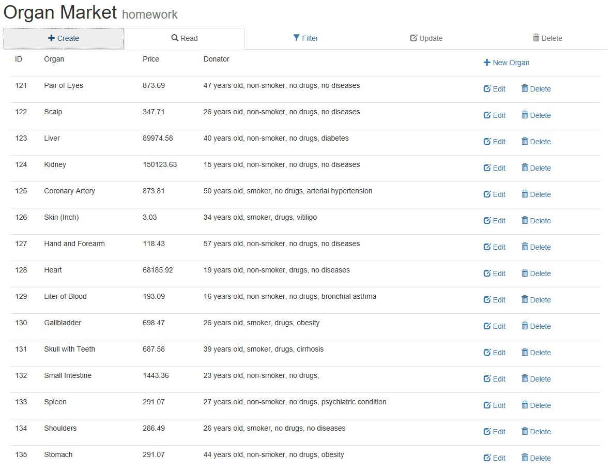

<h1 align="center">
  <br>
  <a href="https://github.com/phoms/organ-market"></a>
  <br>
  Organ Market
  <br>
  <br>
</h1>

<h4 align="center">Um sistema para cadastro de <i>doadores</i> de órgãos.</h4>
<h5 align="center">Segurança de Software I</h5>

<p align="center">
    <a href="https://opensource.org/licenses/MIT"></a>
    <a href="https://github.com/phoms/organ-market/releases"></a>
</p>

Este trabalho é correspondente a primeira e segunda avaliação da disciplina de Segurança de Software da Graduação de Engenharia da Computação do Instituto Infnet.

O intuito do trabalho é desenvolver um sistema simples capaz de fazer as operações de Inclusão, Leitura, Atualização e Remoção de uma entidade qualquer de um banco de dados relacional e realizar um relatório com as vulnerabilidades encontradas, podendo inclive estas serem forçadas para atender o objetivo da avaliação.

As tecnologías utilizadas, conforme descrito no enunciado do trabalho são: Java, com Servlets e JSTL e MySQL.

## Getting Started

Este projeto já vem com a estrutura correta para ser manipulado na IDE Eclipse. Foi utilizado ao longo do desenvolvimento o servidor de aplicação Tomcat em sua versão 8.0.

### Prerequisites

Para executar este projeto localmente é necessário a [JRE](http://www.oracle.com/technetwork/pt/java/javase/downloads/jre8-downloads-2133155.html) 8+, da [JDK](http://www.oracle.com/technetwork/java/javase/downloads/index-jsp-138363.html) 8+ e o [MySQL](https://dev.mysql.com/downloads/).

#### Windows

Apesar de ser possível instalar todas as dependências pelos seus respectivos instaladores, o [Choco](https://chocolatey.org/) facilita o processo, para tal execute o seguinte comando em um terminal no modo administrador:


```
choco install jre8 jdk8 mysql eclipse -y
``` 

No final da instalação execute no terminal o comando `refreshenv` e teste suas configurações com `java -version`, `javac -version`, e `mysql -V`.

Se tudo correu bem deverá aparecer no terminal a versão instalada de cada um dos softwares.

Em seguida você deve criar a estrutura de tabela necessária para o armazenamento das informações. Neste repositório já é oferecido um _script sql_ capaz de criar essa estrutura. Para tal, na raiz do projeto, execute o seguite comando:

```
mysql < \sql\database_seed.sql
```

Isso deve funcionar.

#### Linux

Documentação pendente.

#### MacOS

Documentação pendente.

### Installing

Importe este projeto no Eclipse, adicione ele no Tomcat.

Se tudo correu bem até aqui ao acessar a página [http://localhost:8080/read](http://localhost:8080/read) você deverá ver algo parecido com a imagem abaixo:

<center></center>

### Running the tests

Não tem teste.

### Deployment

[](https://heroku.com/deploy)

### Built With

- [Java](http://www.oracle.com/technetwork/pt/java/javase/downloads/jre8-downloads-2133155.html), código.


## Authors

- Cristina Silva
- Luiz Felipe Marques de Olivera
- Pedro Henrique Oliveira
- Renato Motta

## License

Este projeto é licenciado sob MIT License - veja o arquivo [LICENSE.md](LICENSE.md) para mais detalhes.

## Acknowledgments

Sim, os preços nos dados de mock são reais.

---
:octocat: